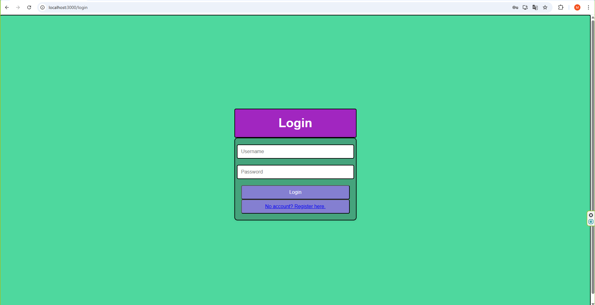
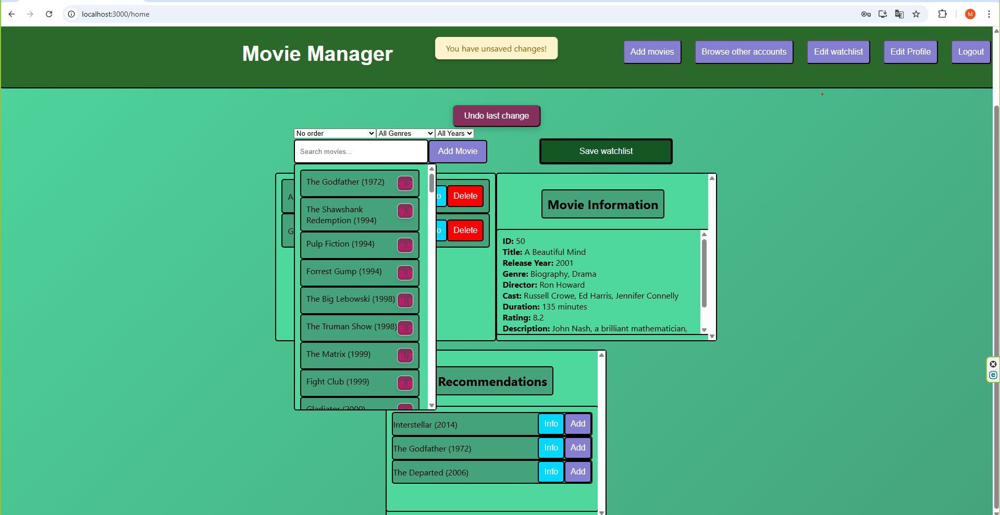
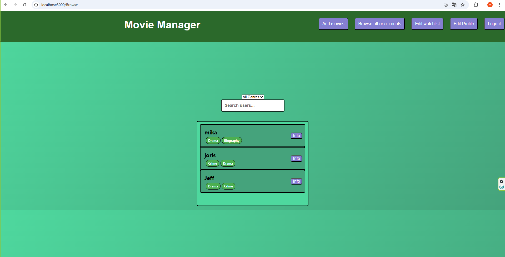
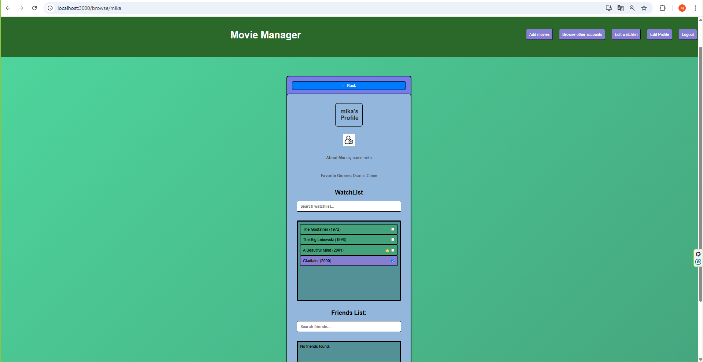
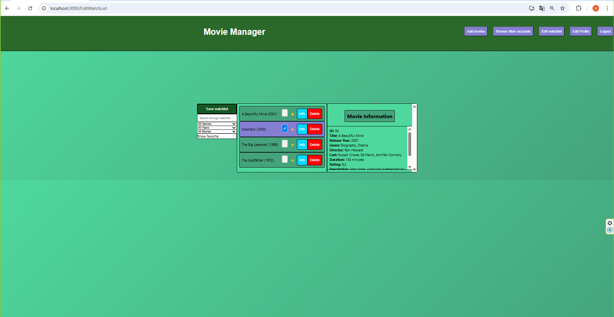
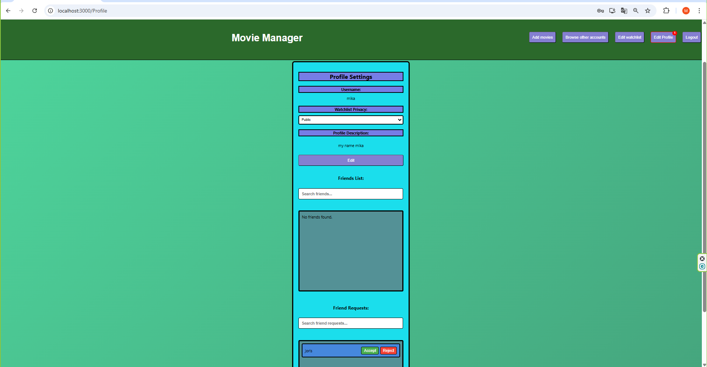
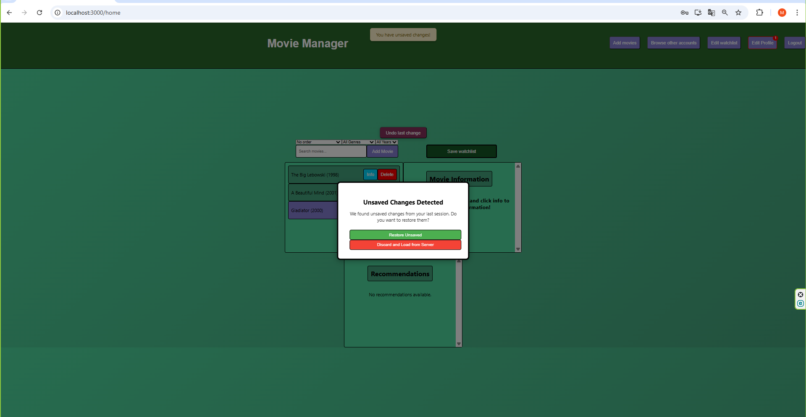

# 🎬 Movie Manager

A secure, full-stack movie watchlist application with personalized recommendations and social features. Built with **React**, **Node.js**, and **MySQL**, and runs inside **Docker** for easy setup and deployment.

---

## 🚀 Features

### 🔐 Authentication & Security
-JWT-based authentication (stored in secure HTTP-only cookies)
    Tokens are generated upon successful login and stored in cookies with httpOnly, secure (in production), and sameSite: 'Lax' to prevent XSS and CSRF attacks.

-CSRF protection using csurf middleware
    CSRF tokens are generated on the server and required for any state-changing operations. They are sent via a dedicated /csrf-token endpoint and validated on all protected routes.

-Rate limiting on login to prevent brute-force attacks
    Login endpoint is protected with express-rate-limit, allowing max 5 failed attempts per 15 minutes per IP. After exceeding the limit, the user receives a cooldown message with retry time.

-Session synchronization across tabs via BroadcastChannel
    When login/logout occurs in one tab, all other open tabs are immediately notified and either update or log out accordingly for a consistent user experience.

-Auto logout/login propagation across all open tabs
    Ensures session state is consistent across browser tabs. If a user logs out in one tab, all other tabs are also logged out immediately to avoid unauthorized actions.

-Password encryption
    User passwords are hashed using bcryptjs with a strong cost factor (saltRounds = 14) before storing in the database, ensuring security even if data is compromised.

-Input validation and sanitization
    User input during registration is validated using express-validator to enforce:

        -Minimum password length and complexity

        -Valid email format

        -Alphanumeric usernames

        -Input is also sanitized to mitigate injection and formatting attacks.

-CORS configuration
Only allows requests from your React frontend (http://localhost:3000), with credentials enabled. Headers such as Authorization and X-CSRF-Token are explicitly allowed.

-SQL injection protection
All MySQL queries use parameterized statements (via mysql2/promise) to prevent injection of malicious SQL code.

-Token-based route protection
A reusable authenticateToken middleware is used to protect all authenticated routes like /home, /me, and data-modifying endpoints.

-In-memory caching with expiration
Frequently accessed data (e.g., watchlists, friend lists) is cached server-side using node-cache, reducing DB load while still maintaining up-to-date information via cache invalidation on data changes.

### 👤 User Accounts
- Register and log in with strong validation
- Automatically fetch and cache user data upon login
- Edit user bio
- CSRF token fetched once after login and reused globally

### 🎥 Watchlist Management
- Add/remove movies from your watchlist
- Mark movies as watched and/or favorite
- Undo/redo recent changes with a history stack
- Smart caching using `localStorage`
- Restore unsaved changes after unexpected browser closure
- Watchlist stored per user

### 🔍 Discovery & Browsing
- View all users and their favorite genres
- Filter users by their genre
- View user profiles (based on privacy setting)
- Browse movies and add to your watchlist
- filter through movies 
- state management when browsing other accounts (E.G. possible to backtrack last visited accounts)

### 🤝 Friends & Social
- Send, cancel, accept, or reject friend requests
- Auto-accept mutual friend requests
- Control watchlist visibility (Private / Friends Only / Public)
- View / search through  friend list and request status on profiles
- Notification badge for incoming friend requests

### Recommendations
- Personalized movie recommendations based on each user's unique watch history and preferences.
- Powered by a custom machine learning engine using collaborative filtering and cosine similarity to detect similar users based on their watchlists.
- Falls back to genre-based recommendations if no similar users are found or the user has a very small watchlist.
- Uses parallel processing (multiprocessing.Pool) to efficiently collect recommendations from multiple similar users, ensuring fast performance even with many users.
- Dynamically updates after each change to the user's watchlist, ensuring recommendations are always relevant.
- Built with FastAPI for the ML backend and pandas + scikit-learn for data handling and similarity calculations.
- Fallback strategy includes:
    Most common genre detection from user's watched movies.
    Top-rated, most recent global movies if watchlist is completely empty.

---

## 🧱 Tech Stack

| Layer             | Tech                                                                 |
|------------------|----------------------------------------------------------------------|
| Frontend          | React, TypeScript, CSS Modules                                       |
| Backend           | Node.js, Express.js, Helmet, CORS, Axios                             |
| Authentication    | JWT (HTTP-only Cookies), CSRF (`csurf`), Bcrypt (Password Hashing)  |
| Database          | MySQL                                                                |
| State Management  | React Context API (AuthContext, WatchlistContext)                    |
| Machine Learning  | FastAPI, Scikit-learn (Collaborative Filtering)                      |
| Containerization  | Docker, Docker Compose                                               |


---

## Preview
















## ⚙️ Setup Instructions

### 1. Prerequisites

Before you begin, make sure you have the following installed:

- ✅ [Docker](https://www.docker.com/get-started)
- ✅ [Docker Compose](https://docs.docker.com/compose/install/)

> 📝 This app uses Docker to run the frontend, backend, database, and ML recommendation engine in isolated containers.

---

### 2. Clone the Repository

```bash
git clone https://github.com/mikahagenbeek692/MovieManager.git
cd MovieManager
```

---

### 3. Set Up Environment Variables

Create a `.env` file in the root directory (or rename `.env.example` to `.env`) and fill in your MySQL and secret values:

```env
DB_USER=your_mysql_username
DB_PASSWORD=your_mysql_password
DB_NAME=projectapi
SECRET_KEY=your_secure_secret_key
```

> 🛡️ **Never commit your `.env` file** to version control. It's already ignored via `.gitignore`.

---

### 4. Build and Start the App Using Docker

Run the following to build and start all services:

```bash
docker-compose up --build
```

This will:

- 🗄️ Spin up the MySQL database  
- 🛠️ Start the backend Express server (Node.js)  
- 🧩 Start the React frontend  
- 🤖 Start the FastAPI ML recommendation engine  

> ⏱️ First build may take a couple of minutes as all images are built and dependencies are installed.

---

### 5. Access the App

Once all containers are running, you can access the services:

- 🌐 Frontend: [http://localhost:3000](http://localhost:3000)  
- 🛠️ Backend API: [http://localhost:5000](http://localhost:5000)  
- 🤖 Recommendation API: [http://localhost:8000](http://localhost:8000)  

---

### 6. (Optional) Seed the Database with Sample Data

If you want to populate your local database with sample users and movies:

#### Option A: Use MySQL CLI with Docker

```bash
docker exec -i mysql mysql -u root -p projectapi < databaseSetup.sql
```

> You'll be prompted to enter the MySQL root password (the one from your `.env` file).

#### Option B: Manually Import via GUI

You can also open `seed.sql` in a tool like **DBeaver**, **MySQL Workbench**, or any other MySQL-compatible database manager.

---

### 7. Development Tips

- 🧾 Backend logs appear in the terminal from Docker Compose  
- ⚛️ Frontend uses **React Context API** for Auth & Watchlist state  
- 🔐 You can test **login, registration, and recommendations** immediately  
- 🛡️ API rate-limiting and **CSRF protection** are enforced — use proper headers when testing

## 📬 Contact

Made by [Mika Hagenbeek](mailto:mika.hagenbeek@gmail.com)
